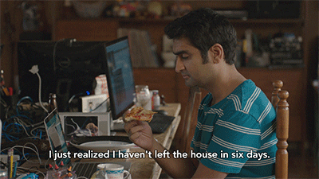

<!-- Intro  -->
<h3 align="center">
        <samp>&gt; Hey There <b>&lt;coders/&gt;!</b>, I am
                <b><a target="_blank" href="https://linkedin.com/in/kdrakoulakis">jdkyriakos</a></b>
        </samp>
</h3>

        <!-- Organisation  -->
        <samp>
                「 10101010 」
                 
                「 Software is the hidden writing that whispers the stories of possibility to our hardware - <b>We are storytellers.</b> 」
                 
                 
        </samp>

##  About me

> Hi 👋, I'm a Senior engineer with over 15 years of experience in software development.
> 
> I like programming and always want to learn and master new skills.

 
&nbsp;&nbsp;「  My <a  href="https://kit.co/jdkyriakos/dev-battle-station">Dev gear</a>  」
 

##  Connect with me

<table>
    <tr>
        <td valign="center" width="50%">
            
 
                    
 
                    
                    
                     
                    <!-- More svg icons
                        https://simpleicons.org/
                    -->
                     

                    
  

            

        </td>
        <td valign="top" width="50%">
            
 
                     
            

        </td>
    </tr>
</table>   

##  Tech Stack Awareness

![Git][git]&nbsp;&nbsp;&nbsp;&nbsp;
![intellijidea][intellijidea]
![VS Code][VS Code]
![neovim][neovim] &nbsp;&nbsp;&nbsp;&nbsp;&nbsp;&nbsp;
![linux][linux]
![windows][windows]

[git]: https://img.shields.io/badge/-Git-%23F05032?style=flat-square&logo=git&logoColor=%23ffffff

[intellijidea]: https://img.shields.io/badge/-IntelliJ-%23007ACC?style=flat-square&logo=intellijidea&color=white&logoColor=000000
[VS Code]: https://img.shields.io/badge/-VSCode-%23007ACC?style=flat-square&logo=visual-studio-code
[neovim]: https://img.shields.io/badge/-Neovim-%2523007ACC?style=flat-square&logo=neovim&logoColor=37b026 

[linux]: https://img.shields.io/badge/-Linux-%23007ACC?style=flat-square&logo=linux&color=ffd454&logoColor=000000
[windows]: https://img.shields.io/badge/-Windows-%23007ACC?style=flat-square&logo=windows

<table><tr><td valign="top" width="33%">

 
 
</a>  
 
  
<!--  
  
  
  
  
  
  
  
  
  
  
  
  
  
  
  
  
  
  
  
  
  
  
  
  
  
  
  
  
  
  
  
  
  
  
  
  
  
  
  
  
  
  
  
  
  
  
  
  
  
  
  
  
  
  
  
  
  
  
  
  
 
--> 

</td><td valign="top" width="33%">
    
     
      
    <!--
  
 -->

  

</td><td valign="top" width="33%">

  
    
      

</td></tr></table>  

 

## Bonus
<!-- Meme Section-->

    
 <samp>&#9776; Meme</samp>

    

         
        <!-- Activity Widget -->
        
         
    

  

 
